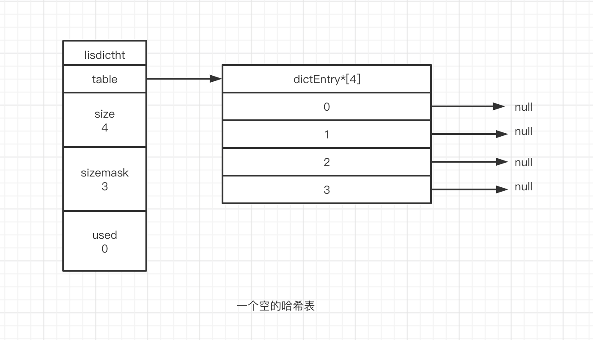
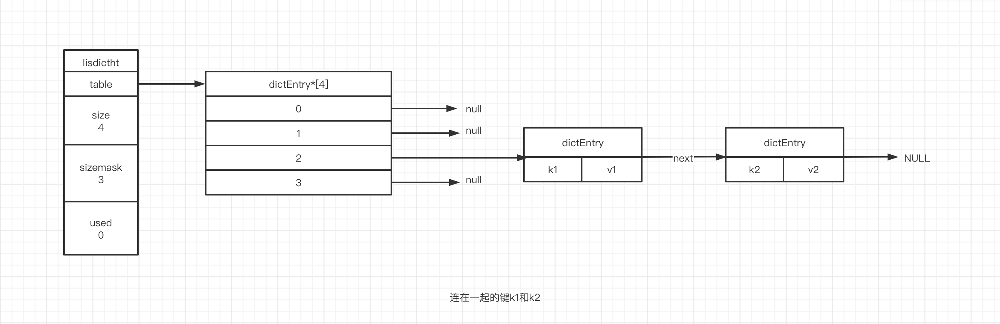
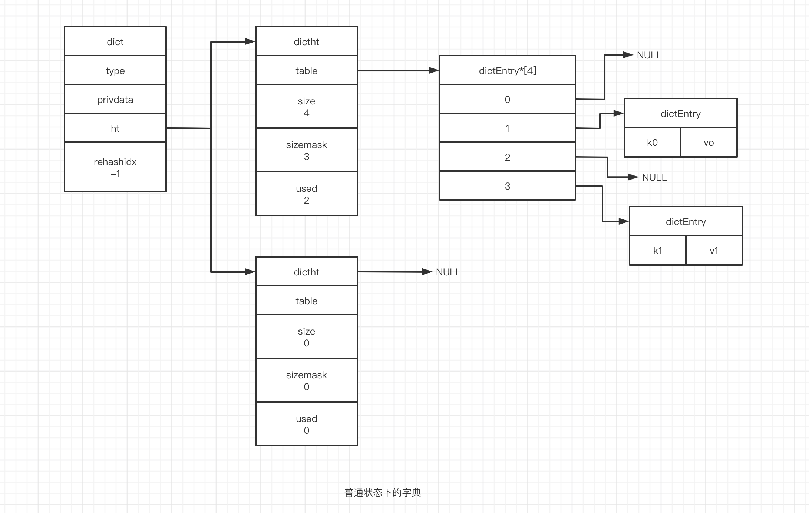
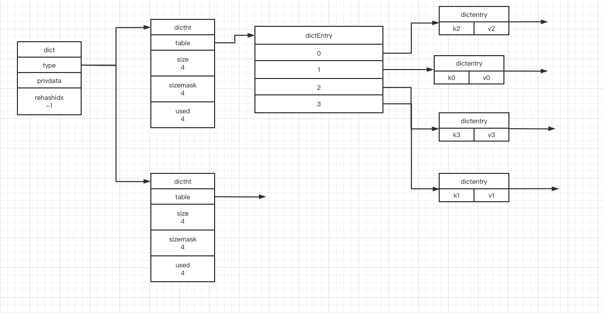
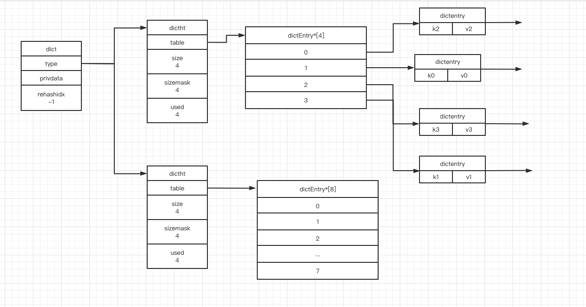
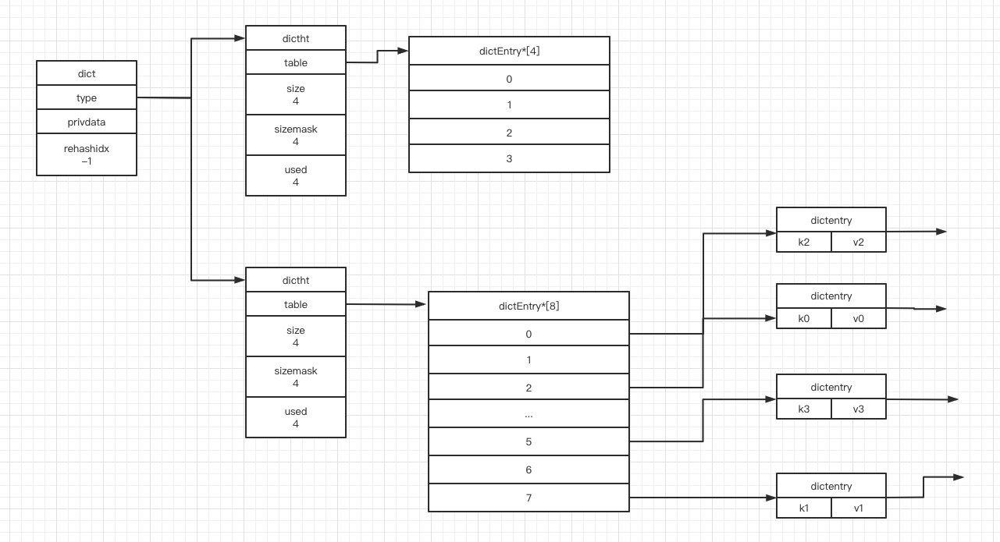
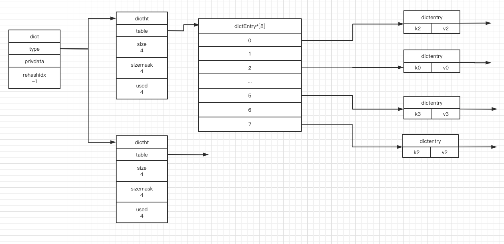

### 字典的实现

字典使用哈希表作为底层实现,一个哈希表中可以有多个哈希表节点,而每个哈希表节点保存了字典中的一个键值对.

#### 哈希表

redis字典中使用的哈希表由dict.h/dictht结构定义

```c
	typedef struct dictht{
    //哈希表数组
    dictEntry **table;
    
    //哈希表大小
    unsigned long size;
    
    //哈希表大小掩码,用于计算索引值,总是等于size-1
    unsigned long sizemask;
    
    //哈希表已有节点的数量
    unsigned long used;
    
  } dictht;
```


table属性是一个数组数组中每个元素都是指向dict.h/dictEntry结构的指针,每个dictEntry结构保存这一个键值对,size记录了哈希表的大小,即table数组的大小.used属性记录着哈希表已有节点(键值对)的数量.sizemask属性的值总是等于size-1,这个属性和哈希值一起决定一个键被放到table数组的哪个索引上.




#### 哈希表节点

哈希表节点使用dictEntry结构表示,每个dictEntry结构都保存着一个键值对:

```c
	typedef struct dictEntry{
    //键
    void * key;
    
    //值
    union{
      void *val;
      uint64_t u64;
      int64_t s64;
    } v;
    
    //指向下个哈希表节点,形成链表
    struct dictEntry *next;
  }dictEntry;
```


key属性保存着键值对中的键,而v属性保存着键值对中的值,其中值可以是一个指针,或者是一个uint64_t整数,又或者是一个int64_t整数.next属性是指向另一个哈希表节点的指针,这个指针将多个哈希值相同的键值对连接在一起,解决键冲突的问题.



#### 字典

Redis中字典由dict.h/dict结构表示

```c
typedef struct dict{
  //类型特定函数
  dictType *type;
  
  //私有数据
  void *privdata;
 
  //哈希表
  dictht ht[2];
  
  //rehash索引,当rehash不在进行时,值为-1
  int rehashidx;//rehashing not in progress if rehashidx == -1
}dict;
```

type属性和privdata属性是针对不同类型的键值对为创建多态字典而设置的;

+ type指向一个dictType类型的指针,每个dictType保存了一簇用于操作指定类型的键值对的函数,redis会为用途不同的字典设置不同的类型特定函数.
+ 而privdata属性则保存了需要传给那些特定函数的可选参数

```c
typedef struct dictType{
	//计算哈希值的函数
  unsigned int (*hashFunction)(const void *key);
  
  //复制键的函数
  void *(*keyDup)(void *privdata,const void *key);
  
  //复制值的函数
  void *(*valDup)(void *privdata,const void *key);
  
  //对比键的函数
  void *(*keyCompare)(void *privdata,const void *key1,const void *key2);
  
  //销毁键的函数
  void *(*keyDestructor)(void *privdata,const void *key);
  
  //销毁值的函数
  void *(*valDestructor)(void *privdata,const void *key);
}dictType;
```


ht属性是一个包含两个项的数组,数组的每一项都是dictht哈希表,一般情况下,字典只使用ht[0]哈希表,ht[1]哈希表只会在对ht[0]哈希表进行rehash的时候使用.

另一个和rehash有关的属性就是rehashidx,它记录了rehash目前的进度,如果目前没有进行rehash,那么它的值是-1.

下图展示里一个普通状态下的字典

<<<<<<< HEAD



### 哈希算法

要将一个新的键值对添加到字典里面时,程序需要先根据键值对的键计算出哈希值和索引值,然后再根据索引值.将包含新键值对的哈希表节点放到哈希表数组指定的索引上面

Redis计算哈希值和索引值的方法如下:

```
#使用字典设置的哈希函数,计算key的哈希值
hash = dict->type->hashFunction(key);

#使用哈希表的sizemask属性和哈希值计算索引值
#根据情况不同,ht[x]可以是ht[0]或者ht[1];
index  = hash & dict->ht[x].sizemask;

```

当字典被当做数据库的底层实现,或者哈希键的底层实现,Redis使用MurmurHash2算法来计算哈希值.


### 解决键的冲突

当两个或者两个以上的键被分配到哈希表数组的同一个索引上时,我们称这些键发生了冲突(collision)

Redis使用链地址法(separate chaining)来解决键冲突.每个哈希表节点都有一个next指针构成了一个单项链表,被分配到同一个索引上的多个节点可以使用单向链表连接起来,这样就解决了键冲突.


#### rehash

随着操作的不断执行,哈希表保存的键值对会逐渐增多或者减少,为了让哈希表负载因子(load factor)维持在一个合理的范围内,当哈希表的键值对的数量过多或者过少时,程序需要对哈希表进行响应的扩张或者收缩,这个过程叫做rehash

步骤如下:

1. 为字典的ht[1]分配空间,空间大小取决于要执行的操作 ,以及ht[0]当前包含的键值对数量(ht[0]used属性的值),
   - 如果执行的是拓展操作,ht[1]的大小是第一个大于等于ht[1].used*2的 $2^n$
   - 如果执行的是收缩操作,那么ht[1]的大小为ht[1].used的 $2^n$
2. 将保存在ht[0]中的键值对rehash到ht[1]上,reshah指的是重新计算键的哈希值,然后将键值对放到ht[1]的指定位置上
3. 当ht[0]中的全部键值对都迁移完了(ht[0]成了空表),释放ht[0],将ht[1]设置为ht[0],并在ht[1]处重新创建一个空白哈希表,为下一次rehash做准备

举个栗子:



<center>执行rehash之前的字典</center>

ht[0]当前used值为4,4*2=8,8是2的三次方恰好是第一个大于4的2的n次方,所以ht[1]的大小会设置成8



<center>为ht[1]分配空间</center>

将ht[0]的键值对rehash到ht[1]上



<center>迁移键值对</center>

释放ht[0],将ht[1]设为ht[0],然后为ht[1]分配一个空的哈希表



<center>rehash之后的字典</center>

#### 哈希表的拓展与收缩

当一下任一条件满足时,程序会对哈希表进行扩展操作

1. 当前服务器没有执行BGSAVE命令或者BGREWITEAOF命令,并且哈希表的负载因子大于1
2. 当前服务器正在执行BGSAVE命令或者BGREWITEAOF命令,并且哈希表的负载因子大于5

负载因子的计算公式

```
负载因子 = 哈希表已经保存的节点数量/哈希表大小
```

在BGSAVE命令或者BGREWITEAOF命令的执行过程中,服务器会创建一个子进程,大多数操作系统都是采用写时复制(copy-on-write)来优化子进程的使用效率,所以在子进程的存在期间会提高负载因子,避免在子进程运行期间进行哈希表扩展操作.


当哈希表的负载因子小于0.1,会进行收缩操作.


#### 渐进式rehash

以下是哈希表渐进式rehash的详细步骤

1. 为ht[1]分配空间,让字典同时持有两哈希表
2. 在字典中维持一个索引计数器变量rehashidx,并将它的值设置为0,表示rehash工作正式开始
3. 在rehash进行期间,每次对字典执行添加,删除,查找或者更新操作时,程序除了执行指定的操作外,还会顺带将ht[0]在rehashidx索引上的键值对rehash到ht[1],当rehash工作完成后,rehashidex的属性值增加1.
4. 随之字典操作的不断执行,最终在某个时间点上,ht[0]中的所有键值对会被rehash到ht[1]上,这时程序将rehashidx的值设为-1,表示rehash操作完成.


#### 渐进式哈希执行期间哈希表操作

在此期间,字典的删除,查找,更新等操作会在两个哈希表上进行,例如要在字典里查询一个键,程序会在ht[0]中进行查找,如果没有找到的话就会继续在ht[1]中进行查找

另外,渐进式rehash执行期间,新添加的键值对一律保存到ht[1]里,,这一措施保证了ht[0]中的键值只增不减,随着rehash的操作主键变为空表

### 字典的API

| 函数             | 作用                                                         | 时间复杂度                 |
| ---------------- | ------------------------------------------------------------ | -------------------------- |
| dictCreate       | 创建一个新的字典                                             | o(1)                       |
| dictAdd          | 将给定的键值对添加到字典中                                   | o(1)                       |
| dictReplace      | 将给定的键值对添加到字典中,如果键已经存在,用新的值替代旧的值 | o(1)                       |
| dictFetchValue   | 返回给定键的值                                               | o(1)                       |
| dictGetRandomKey | 从字典中随机返回一个键值对                                   | o(1)                       |
| dictDelete       | 从字典中删除给定键的键值对                                   | o(1)                       |
| dictRelease      | 释放给定字典,以及字典中包含的所有键值对                      | o(n),n为字典中键值对的数量 |

