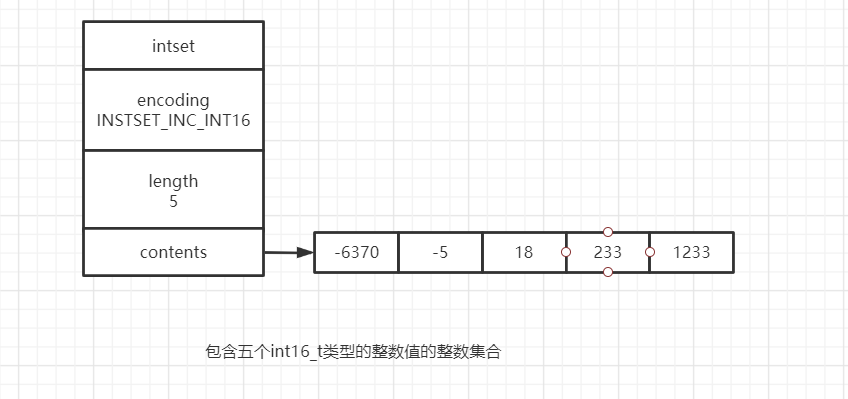

整数集合(intset)是是集合键的底层实现之一,当一个集合只包含整数元素,并且这个集合元素数量不多时,Redis就会使用整数集合作为集合键的底层实现


### 整数集合的实现

整数集合可以保存类型为int16_t,int32_t,int64_t的整数值.inset.h/intset结构表示整数集合

```c
typedef struct intset{
    //编码方式
    uint32_t encoding;
    
    //集合包含的元素数量
    uint32_t length;
    
    //保存元素的数组
    int8_t contents[];
}
```

整数集合的每一个元素都是contents的数组项.各个项在数组中按照值的大小从小到大有序排列,并且数组中不包含重复项(因为是集合).length属性记录了整数集合包含的元素数量,也就是contents数组的长度

虽然contents的属性声明为int8_t的数组,但是实际上contents不保存任何int8_t类型的值,,contents正在的类型取决与encoding属性的值


| encoding属性值   | contents的实际类型 |      |
| ---------------- | ------------------ | ---- |
| INTSET_ENC_INT16 | int16_t            |      |
| INTSET_ENC_INT32 | int32_t            |      |
| INTSET_ENC_INT64 | int64_t            |      |




1. 长度为5
2. 按照从小到大的顺序排列
3. 因为每个元素都是int16_t类型的整数,所以contents数组的大小是16*5=80字节


### 升级

要将一个元素添加到整数集合中,而且新元素比目前所有的元素都要长是,整数集合需要先升级(upgrade)才能将新元素添加到整数集合中.步骤分为三步

1. 根据新元素的类型,拓展整合集合,并为新元素分配空间
2. 将数组底层所有的元素转化为新元素相同的类型,并将装换后的元素放到正确的位置上,在放置元素的过程中需要保持原有数据的有序性不变

举个例子:集合中包含3个int16_t类型的整数1,2,3,我我们新增加整数65535,65535需要占用四个字节(32位)的空间

|  位  | 0-15位 | 16-31位 | 32-47位 |  48-127位  |
| :--: | :----: | :-----: | :-----: | :--------: |
| 元素 |   1    |    2    |    3    | 新分配空间 |

|  位  | 0-15位 | 16-31位 | 32-47位 | 48-63位    | 64-95位 | 96-127位   |
| :--: | :----: | :-----: | :-----: | ---------- | :-----: | ---------- |
| 元素 |   1    |    2    |         | 新分配空间 |    3    | 新分配空间 |

|  位  | 0-15位 | 16-31位 | 32-64位 | 64-95位 |  96-127位  |
| :--: | :----: | :-----: | ------- | :-----: | :--------: |
| 元素 |   1    |         | 2       |    3    | 新分配空间 |

|  位  | 0-31位 | 32-63位 | 64-95位 |  96-127位  |
| :--: | :----: | :-----: | :-----: | :--------: |
| 元素 |   1    |    2    |    3    | 新分配空间 |

|  位  | 0-31位 | 32-63位 | 64-95位 | 96-127位 |
| :--: | :----: | :-----: | :-----: | :------: |
| 元素 |   1    |    2    |    3    |  65535   |

最后将集合的encoding属性设置为INTSET_ENC_INT32,length的值设为4

因为每次将添加新元素都有可能引起升级,而每次升级需要对底层数组中的元素进行转换,所以向整数集合添加新元素的时间复杂度是o(N).


#### 升级后元素的摆放位置

因为引发升级的新元素的长度总是大于已有元素的长度,所以这个元素的值要么大于现有元素,要么小于现有元素,所以新元素要么放在数组的开头(小于现有元素),要么在数组的结尾(大于现有元素)

#### 升级的好处

1. 提升灵活性
2. 解约内存

### 降级

不提供降级的功能.


### 整数集合的API

| 函数         | 作用                         | 时间复杂度                         |
| ------------ | ---------------------------- | ---------------------------------- |
| insetNew     | 创建一个新的整数集合         | o(1)                               |
| insetAdd     | 将指定的元素添加的整数集合   | o(N)                               |
| insetRemove  | 从整数集合中移除给定元素     | o(N)                               |
| insetFind    | 检查给定的值是否存在于集合中 | 因为有序,可以使用二分法查找o(logN) |
| insetRandom  | 随机返回一个元素             | o(1)                               |
| insetGet     | 取出底层数组给定索引上的元素 | o(1)                               |
| insetLen     | 返回整数集合包含的元素合数   | o(1)                               |
| insetBlobLen | 返回整数集合占用的内存字节数 | o(1)                               |

